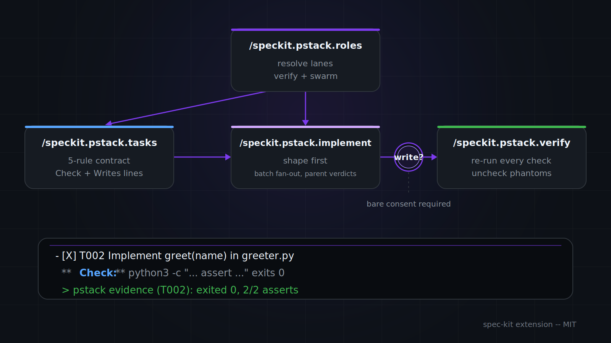

<div align="center">


**pstack rigor for [spec-kit](https://github.com/github/spec-kit) tasks**

[](https://github.com/github/spec-kit)
[](LICENSE)
[](https://github.com/github/spec-kit/blob/main/extensions/EXTENSION-DEVELOPMENT-GUIDE.md)


</div>

---

Spec-kit decides what to build. This extension enforces how the work gets implemented: every task is a verifiable unit with a named proof, independent tasks fan out to subagents, and no task is done until its check passes against the real artifact.

<div align="center">

</div>

## Why

A generated task list says what to do, and nothing holds it to a standard of proof. "Works correctly" is not a check. Parallel markers lie, and a completed checkbox is a claim, not evidence. The [pstack](https://github.com/cursor/plugins/tree/main/pstack) discipline fixes this with verifiable units, named acceptance checks, and evidence-gated completion. This extension ports that discipline into spec-kit as four slash commands, so the rigor survives the whole run: contract in, evidence out.

The extension carries the task-contract subset of pstack rigor. Poteto's playbooks and the remaining principles are out of scope.

## Install

```bash
specify extension add pstack --from https://github.com/jreco/speckit-pstack/archive/refs/tags/v0.1.0.zip
```

For development, install from a local checkout:

```bash
specify extension add --dev /path/to/speckit-pstack
```

## Commands

The commands replace the corresponding core steps. Run them instead of the built-ins.

| Command | Replaces | What it enforces |
|---|---|---|
| `/speckit.pstack.tasks` | runs after the core tasks step | The task contract (below) |
| `/speckit.pstack.implement` | the core implement step | Shape-first, evidence-gated execution with disjoint-write `[P]` batches |
| `/speckit.pstack.verify` | none, it is a new gate | Independent re-proof of every checked task |
| `/speckit.pstack.roles` | none, it is setup | Lane-to-pstack-role dispatch resolution |

## The task contract

`/speckit.pstack.tasks` audits and repairs `tasks.md` against five rules:

1. **Verifiable unit.** Each task is small enough that one step proves it done.
2. **Named acceptance check.** Every task carries a `**Check:**` line with the exact command, value, or surface that proves it.
3. **Data shape first.** Producers of a shape precede its consumers, and each consumer names the shape it consumes.
4. **Honest parallel markers.** `[P]` only when the task's check passes while every other `[P]` task in the phase also runs. The task lists every file it will write on a `**Writes:**` line, and no two `[P]` tasks in a phase list the same file.
5. **No silent scope.** New dependencies and public-surface changes are named in the task text.

## Implementation with rigor

`/speckit.pstack.implement` executes the task list. It defines the data shape before consuming code, then runs each task in this session unless a `[P]` task has another pending `[P]` task in the same phase, which sends the batch through the swarm lane with at most `parallel.max_workers` concurrent. The dispatcher refuses a batch when a task has no `**Writes:**` line or when two lists overlap, and it refuses to fan out on an unaudited task list. Each subagent gets its task text verbatim, its Check line, its Writes list, and the relevant plan.md and spec.md sections, and it reports PASS or FAIL with a one-line output excerpt plus every file it touched. Subagents never write tasks.md and never commit. The parent applies every verdict, checks each touched-files list against its Writes list and against `git status --short`, marks `[X]` itself, and writes the evidence line. A commit stages exactly the task or batch's own files plus the parent's own tasks.md ledger lines, never a glob. A new evidence note for a task replaces that task's previous note line. Failures stop after two fix attempts and are reported as remaining work.

## Verification

`/speckit.pstack.verify` re-runs every checked task's check in this session against the live artifact and unchecks any task whose proof fails or cannot run. A PASS needs a recorded output excerpt plus an answer to the masking question, what would make the check pass while the task is broken. The re-run catches shared-state regressions; it cannot prove a check's criteria were right. A check that cannot run is VOID, and a checked task with no `**Check:**` line takes VOID immediately. VOID routes by cause: a missing or unusable Check line goes to the tasks command for repair, a gone target or command goes to implement to rebuild the artifact. All PASS is the only green.

## Roles and dispatch

Two lanes dispatch work. Each lane resolves in this order:

1. The lane's pstack role is configured. Dispatch through it, and the lane's yaml selector stays inert.
2. Otherwise, when the lane's `roles.<lane>` selector in `.specify/extensions/pstack/pstack-config.yml` is non-empty, dispatch a subagent on that model by whatever mechanism the harness provides.
3. Empty or missing, so run inline in this session with no subagent.

| Lane | pstack role | Agent kind | Dispatched by |
|---|---|---|---|
| verify | `interrogate reviewers` | readonly | `/speckit.pstack.verify` check batches |
| swarm | `swarm workers` | poteto | `/speckit.pstack.implement` `[P]` batches |
The verify lane is a panel role and needs an index. The canonical table lives in `/speckit.pstack.roles`, which also prints the resolved table for this machine.

Its `sync` mode pushes non-empty yaml selectors into the mapped pstack roles through the pstack plugin's own writer, and it never hand-edits the rule file. It prints the full next map, not only the changed lines, plus one line when a panel role shrinks and a `role: <old> -> <new>` line for each change. The write is global to this machine, so it waits for a separate affirmative message before saving. `/setup-pstack` re-derives recommendations and does not restore the prior map, so the printed pre-sync map is the restore reference. A selector outside the approved pool fails validation and nothing is written.

## Requirements

- spec-kit >= 1.0.0
- Tested on OMP with bash. Commands render for other agents through spec-kit's token resolution. `[P]` batches need a harness with a subagent facility; without one they run serially in-session.

## Credits
Adapted from [pstack](https://github.com/cursor/plugins/tree/main/pstack) by [poteto](https://github.com/poteto) (Lauren Tan), MIT licensed, part of the [cursor/plugins](https://github.com/cursor/plugins) collection. This extension ports the task-contract subset of that discipline to [spec-kit](https://github.com/github/spec-kit) by GitHub. See [LICENSE](LICENSE).
