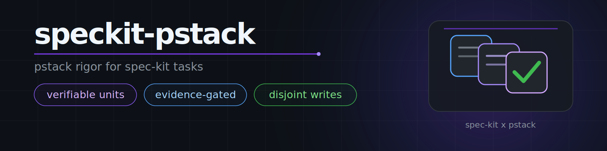

<div align="center">



**full pstack for [spec-kit](https://github.com/github/spec-kit)**

[](https://github.com/github/spec-kit)
[](LICENSE)
[](https://github.com/github/spec-kit/blob/main/extensions/EXTENSION-DEVELOPMENT-GUIDE.md)

</div>

---

Spec Kit decides what to build. This extension supplies pstack's task contract, model routing, Poteto mode, playbooks, and principles as ordinary Spec Kit commands. The runtime validates configuration, paths, and worker reports; agents apply the task and review procedures.

Version `0.2.0` is the first release of the full port. `0.1.0` carried only the task contract: four commands, no mode, no playbooks, no model routing.

## Install

From a local checkout, which is the supported path until a release archive exists:

```bash
specify extension add --dev /path/to/speckit-pstack
```

Or from a directory copy:

```bash
specify extension add . --force
```

There is no `v0.2.0` tag archive, so the URL form (`specify extension add pstack --from https://github.com/Jrecos/speckit-pstack/archive/refs/tags/v0.2.0.zip`) is not advertised until that tag exists.

Prepare a project:

```bash
specify extension list                 # pstack should be listed and enabled
/speckit.pstack.setup-pstack           # detect selectors, write the project role map
/speckit.pstack.poteto-mode on         # optional: load the mode in future sessions
```

Uninstall needs one step first: `/speckit.pstack.poteto-mode off`. `specify extension remove pstack` deletes the extension directory and cannot edit your instruction file, so a leftover mode block would point at a missing extension. The block detects that and says so instead of pretending the mode loaded.

## What you get

| Entry point | What it is |
|---|---|
| 47 `speckit.pstack.*` commands | Every upstream skill, translated: the 23 principle leaves, `poteto-mode`, the routed workflows (`how`, `why`, `arena`, `swarm`, `architect`, `interrogate`, `reflect`), the support skills (`recall`, `tdd`, `unslop`, `no-comments`, `technical-writing`, `blast-radius`, `bro`, `teach`, `figure-it-out`, `automate-me`, `make-bot-ui`, `create-verification-skill`, `maintain-verification-skill`, and the rest) |
| `/speckit.pstack.poteto-mode` | Enters the mode for this session and runs the task; `on`/`off`/`status` manage the project bootstrap |
| `/speckit.pstack.roles` | Resolves the dispatch lanes for this project and reports what this host can do |
| `/speckit.pstack.tasks` | Applies the task contract to `tasks.md` |
| `/speckit.pstack.implement` | Executes `tasks.md` under the contract |
| `/speckit.pstack.verify` | Re-proves every checked task from live artifacts |
| `/speckit.pstack.mode-refresh` | Mandatory hook before the core Spec Kit phases while enabled; no-op when project mode is off |
| 23 playbooks | Bundled under `resources/skills/poteto-mode/playbooks/`, reachable from the mode resource |
| 2 agent contracts | `resources/agents/poteto-agent.md` and `resources/agents/comment-sicko.md`, read by workers |
| Dormant automation pack | `resources/automations/benny/`, not registered as commands, entered through its own `FOR_AGENTS.md` |

Nothing here is a separate pstack plugin. A normal command reads the shared host contract and exactly one resource:

```
/speckit.pstack.how where does the retry policy live
```

## Roles and dispatch

The project role map is `.specify/extensions/pstack/pstack-models-config.yml`, strict JSON so the runtime helper needs no YAML parser. It holds the 17 upstream role labels, the approved selector `pool`, and the fan-out cap. There is no dispatch-timeout setting: the workflow's prompt step uses native Spec Kit's own timeout, a literal in `.specify/extensions/pstack/workflows/dispatch.yml`.

```bash
python3 .specify/extensions/pstack/runtime/pstack-native.py config-init
python3 .specify/extensions/pstack/runtime/pstack-native.py config-show
python3 .specify/extensions/pstack/runtime/pstack-native.py role-plan --role "bug-fix"
python3 .specify/extensions/pstack/runtime/pstack-native.py capability-report
```

- `role-plan` reports a `kind`. A `panel` (`arena runners`, `architect runners`,
  `interrogate reviewers`) runs one worker per configured entry, indices 1-based,
  duplicates preserved, or just the leg named by `--index N`. `arena cross-judge
  pool` is `choose-one`: select exactly one configured entry from its pool,
  preferring a different model family from the parent and candidate panel, and
  never allocate the whole list. Every other role is `single`.
- `--index` is a configured selector index. It is required for the four
  multi-selector roles and rejected for a single-selector role; it is never a
  repeated worker's ordinal, and `run-new --legs` only repeats a single role.
- `inherit-parent` and `auto` mean the current model. Native subagent dispatch
  omits the model. CLI dispatch passes the concrete current model as
  `--parent-model`, and only `swarm workers` may carry an explicit `--race-model`,
  which must be concrete and already in the approved pool.
- A selector outside `pool` fails validation. A rejected selector fails the
  leg. There is no substitution or cross-family fallback.
- Writes use compare-and-swap under a POSIX advisory lock. Each managed file has a
  persistent `<name>.lock` sidecar that pstack never deletes, because unlinking a
  held lock would let two writers believe they are exclusive. The helper refuses
  symlinked data and lock paths. New files it writes are owner-private, an existing
  file keeps its mode, and concurrent setup runs cannot lose an edit.

`/speckit.pstack.roles` prints the resolved table for this machine, and
`/speckit.pstack.setup-pstack` owns every write. Setup always inspects non-empty
legacy lane values in `.specify/extensions/pstack/pstack-config.yml`, whether or not
the role map already exists. A `pristine` map (absent, or still the untouched
scaffold, as `config-show` reports it) gets the migration proposal with unrelated
metadata preserved; a customized map gets a delta for explicit reconciliation
instead, and migration never overwrites it. Re-running a migration whose values are
already applied is a byte-preserving no-op, and more than one legacy `swarm`
selector is rejected rather than truncated.

### How a delegate is dispatched

Native subagent first. When the host has none, allocate a run, write its prompt,
build one validated request from the role, and run the Spec Kit workflow:

```bash
request_json=$(
  python3 .specify/extensions/pstack/runtime/pstack-native.py dispatch-request \
    --integration omp \
    --role "bug-fix" \
    --prompt-file "$prompt_file" \
    --report-file "$report_file"
) || exit

PSTACK_DISPATCH_REQUEST="$request_json" \
  specify workflow run .specify/extensions/pstack/workflows/dispatch.yml --json
```

The request is role-first and carries exactly seven keys: `integration`, `role`,
`index`, `model_source`, `model`, `prompt_file`, `report_file`. The helper derives
the model from the role map, so no raw model is ever passed. `model_source` is
`configured` with no extra flag, `parent` with `--parent-model <concrete>` for a
role whose selected entry is an inheritance alias, and `swarm-race` with
`--race-model <concrete>` for role `swarm workers` only. An unapproved model, a
model belonging to another role, a stale role/model binding, a bad role/index/source
combination, and a race override outside the pool are all rejected.

The workflow has no inputs. Its fixed preflight reads that environment value and
passes trusted values to the prompt step. Its fixed final step rereads the same
request and validates the exact report. No arbitrary selector or path is placed in
a workflow shell command.

A five-key read-only pass is valid:

```json
{"verdict": "PASS", "check": "inspected the routed API", "evidence": "definition at api.py:42", "files": [], "reason": ""}
```

`reason` is always a string. A report may add one non-empty string `result` with
the complete prose or research answer. No other key is allowed. `report-check` is
the only verdict boundary; a successful worker process is not a verdict.

## Mode: session and project

- **Session mode.** `/speckit.pstack.poteto-mode <task>` applies Poteto rules to
  this invocation and its delegates. A natural-language opt-out suppresses later
  bootstrap and hook reloads in that session without changing project files.
- **Project mode.** `on` writes one managed block into `AGENTS.md` for OMP and
  Codex or `CLAUDE.md` for Claude. Explicit `off` removes exactly that block and
  leaves every other byte untouched. `status` reports block, registry, resources,
  and caller-supplied session state separately.

The block instructs the agent to check `mode status` and load pstack resources
only when `project_mode.ready` is true. The helper rejects disabled registry
state, missing resources, malformed markers, unsafe paths, and stale writes.
The bootstrap is prompt guidance, not a deterministic tool interceptor. The four
before-phase hooks use the same readiness check and no-op when project mode is
off. Installing pstack does not make OMP intercept unrelated commands globally.

## The task contract

`/speckit.pstack.tasks` audits and repairs `tasks.md`:

1. **Verifiable unit.** Small enough that one step proves it done.
2. **Named acceptance check.** A `**Check:**` line with the exact command, value, or surface.
3. **Data shape first.** Producers of a shape precede its consumers.
4. **Declared writes and honest markers.** Every task carries a `**Writes:**` line, parallel or serial, with `[]` for a task that writes no artifact. `[P]` is earned only when its check passes while the phase's other `[P]` tasks also run, and no two `[P]` tasks in a phase name the same file. Disjointness is a parallel rule, so serial overlap is allowed; a worker's assigned report file is control metadata and never a Writes entry.
5. **No silent scope.** New dependencies and public-surface changes are named.

Repair that changes a task's obligation (a split, a rewritten check, a new writes list, a moved phase) also unchecks it and deletes its stale evidence line, so changed work cannot inherit a completion it no longer earned.

`/speckit.pstack.implement` executes the list: shape first, `[P]` batches isolated in worktrees, one worker per task with a derived role, structured reports, and parent-applied verdicts. It never stashes or commits unrelated work to make the tree look clean, never recovers with a whole-file checkout, and commits only files whose ownership the run can prove. Workers skip project-wide validation while sibling writes are in flight; the parent runs the suite, linters, and build once after integration. Boundary crossings get the full architect workflow, not a paragraph.

`/speckit.pstack.verify` re-runs every checked task's check against the live artifact and unchecks phantoms. It resolves roles and capabilities before delegating, so a VOID caused by a missing surface is reported as such.

## Runtime tools that ship with it

Host-neutral upstream tools stay byte-identical. Host-bound entrypoints are
translated during import and run from their installed paths:

- `.specify/extensions/pstack/resources/skills/poteto-mode/scripts/orch/orch.ts` and `.specify/extensions/pstack/resources/skills/poteto-mode/scripts/watch-pr/watch-pr`: the Bun TSV-backed orchestration and PR watcher, with their existing CLI flags.
- `.specify/extensions/pstack/resources/skills/poteto-mode/scripts/bootstrap.ts`, `.specify/extensions/pstack/resources/skills/poteto-mode/scripts/bun.lock`, and `.specify/extensions/pstack/resources/skills/poteto-mode/scripts/package.json`. `commander@14.0.0` is the only runtime dependency; a default `bun install --frozen-lockfile` also fetches the locked `bun-types` and `typescript` development dependencies.
- `.specify/extensions/pstack/resources/skills/poteto-mode/scripts/check-plan.mjs`: validates the native plan skeleton, requires a concrete live-lane model, and checks an optional `PSTACK_LIVE_MODEL` pin.
- `.specify/extensions/pstack/resources/skills/poteto-mode/scripts/worktree-audit.sh`: reads only `PSTACK_TRANSCRIPTS_DIR`, computes transcript mtimes in the current shell, treats a failed scan as unavailable evidence, and never calls a worktree safe when a fresh matching transcript exists.
- `.specify/extensions/pstack/resources/skills/show-me-your-work/scripts/log.sh`: unchanged, including its formula neutralization.

## Supported hosts

Host mappings live in `runtime/host-contexts.json`. `capability-report` checks CLI paths, but marks unproven session tools as degraded. Inspect and exercise the live tool or harness before claiming access.

| Host | Instruction file | Project skills | Notes |
|---|---|---|---|
| `omp` | `AGENTS.md` | `.claude/skills/`, `.github/skills/` | Browser and terminal support; verify live tool access |
| `claude` | `CLAUDE.md` | `.claude/skills/` | Terminal support; browser needs an external driver |
| `codex` | `AGENTS.md` | `.agents/skills/` | Terminal support; browser needs an external driver |

Any other Spec Kit integration stays invocation-only: no instruction file is written, project skills are reported as `unavailable`, and the extension still runs commands inline.

Generated project skills (verification skills, a personal mode) are written into exactly one directory the host discovers, reported as `skills_dirs` by `pstack-native.py paths`, and discovery is proven in a fresh session before anyone claims the skill is active. When that list is empty, the skill goes under `.specify/pstack/skills/` and the instruction file or brief has to point at it; there is no second copy and no symlink.

### External prerequisites, stated plainly

- `python3` on a POSIX host for the runtime helper. Its compare-and-swap writes
  require `fcntl.flock` and `O_NOFOLLOW`. Linux, macOS, and WSL qualify; native
  Windows does not.
- `node` for `check-plan.mjs`, `bun` for `orch` and `watch-pr`, and a POSIX shell
  for shell helpers.
- `gh` or `origin` for forge work.
- No scheduler or cloud runner ships with pstack. A supplied scheduler or bot
  runner may drive Benny only when it provides documented inspect, create,
  update, run-once, enable, and disable operations plus server-side secrets.
  Without one, Benny remains configured but dormant.
- Webhook, Slack, and tracker actions need endpoints, credentials, and tools the
  user supplied. Missing external capabilities stop that step.

## Proof

The extension is generated, and both tools are re-runnable:

```bash
python3 tools/import_upstream.py --upstream /path/to/cursor-plugins   # regenerate resources, adapters, manifest
python3 tools/check_parity.py --upstream /path/to/cursor-plugins      # verify the packaged tree
python3 -m unittest discover -s tools -p 'test_*.py'                  # CLI and script regressions
```

`check_parity.py` verifies the pinned blobs against the upstream checkout, every packaged target hash, the 47 adapters and their registration, the 23 playbooks, both agent contracts, the three dormant benny skills, link and script closure, the undefined-command scan, the forbidden host-token scan, the role-label callers, the seven-key dispatch contract and its role kinds, the task writes rule, the command-invocation tokens, the one-location skill contract, the migration no-op, the report contract, and the mode protocol. A mutated resource, a renamed command, a broken link, an unexplained transform, or a translated token left behind fails it.

`tools/` is development-only: `.extensionignore` keeps it, the review notes, and local outputs out of the installed extension, while every runtime resource is packaged.

## Layout

```
extension.yml                     manifest: 52 commands, 2 configs, real before-phase hooks
commands/                         4 task-contract commands, the mode-refresh hook, 47 generated adapters
runtime/host-contract.md          the shared policy every command and worker loads
runtime/host-contexts.json        host mappings and capability declarations
runtime/pstack-native.py          role maps, runs, mode, dispatch requests, locks, report checks
workflows/dispatch.yml            one leg through the active integration, then report verification
resources/                        translated skills, playbooks, principles, agents, docs, dependencies
source-manifest.json              every pinned source path, its target, its hash, its transforms
tools/                            importer, parity checker, edit tables, overrides (not installed)
```

## Credits

Adapted from [pstack](https://github.com/cursor/plugins/tree/main/pstack) by [poteto](https://github.com/poteto) (Lauren Tan), MIT licensed, part of the [cursor/plugins](https://github.com/cursor/plugins) collection. The translation covers pstack at commit `889ec4b68fa5aab0e867dad71ec3fdf386ae48f3`, plus the `control-cli`, `control-ui`, and `deslop` references from `cursor-team-kit` in the same repository. See [LICENSE](LICENSE) and `resources/LICENSE`.
