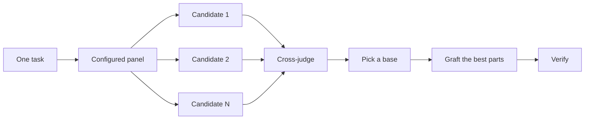

# Design before you write code

One attempt at a hard design locks in the first shape the model thought of. `/speckit.pstack.architect` settles types and boundaries before implementation. `/speckit.pstack.arena` runs several attempts at the same brief and merges the best parts. `/speckit.pstack.interrogate` has other models try to break the result. When the job is coverage rather than design synthesis, `/speckit.pstack.swarm` fans out slices or races and aggregates their results.


## Settle the shape with `/speckit.pstack.architect`

```text
/speckit.pstack.architect design the import pipeline before writing any code. i care most about how callers use it.
```

[`/speckit.pstack.architect`](../../skills/architect/SKILL.md) grounds itself first, running `/speckit.pstack.how` over the code the design touches and `/speckit.pstack.why` when it moves ownership or layers. Then it runs `/speckit.pstack.arena` to produce competing design sketches, with the caller's usage written first in each, followed by types, signatures, and a module map.

By default it proceeds straight from the synthesized design into implementation. If you want to see the design first, say so:

```text
/speckit.pstack.architect with checkpoint. stop and show me before implementing.
```

## Fan out attempts with `/speckit.pstack.arena`

```text
/speckit.pstack.arena take my prompt to the arena verbatim. i want to compare their proposals with yours.
```

[`/speckit.pstack.arena`](../../skills/arena/SKILL.md) is the general tool underneath. N subagents attempt the same design or code brief in parallel, each writing to its own worktree or directory. A read-only judge, on a different model family when your configuration allows one, scores every candidate against a rubric. The coordinator reads each candidate end to end, picks a base, grafts in the best ideas from the losers, and verifies the result.



The panel comes from your [`/speckit.pstack.setup-pstack`](../../skills/setup-pstack/SKILL.md) configuration, and you can adjust it per task. Ask for more candidates when the decision matters, fewer when it doesn't:

```text
/speckit.pstack.arena this, 5 candidates. the cache key format is expensive to change later.
```

## Cover slices and races with `/speckit.pstack.swarm`

```text
/speckit.pstack.swarm check every package under packages/ against its check.sh. one worker per package. one report.
```

[`/speckit.pstack.swarm`](../../skills/swarm/SKILL.md) fans N workers across independent slices, coverage matrices, gauntlet lanes, exploration partitions, or declared race arms. Each worker gets its own scope and check, then reports `PASS`, `ISSUES`, or `BLOCKED`. The parent waits for the workers and returns one compact report with any gaps or dropouts.

Reach for it when parallelism buys coverage or lets independent checks race. `/speckit.pstack.arena` gives every worker the same design or code brief, then picks a base and grafts the best parts. `/speckit.pstack.swarm` covers slices or runs a race with a selection rule declared up front. It does not use the base-selection and grafting ceremony.

## Break it with `/speckit.pstack.interrogate`

```text
/speckit.pstack.interrogate the whole branch, but skeptically. no nitpicks unless it's an actual bug or regression.
```

[`/speckit.pstack.interrogate`](../../skills/interrogate/SKILL.md) sends the same diff, intent, and rubric to several reviewers on different model families. Model diversity is the point. Different models have different blind spots, so a finding two models raise independently is high-confidence signal. The lead sorts everything into `Act on`, `Consider`, `Noted`, and `Dismissed`, with a reason for each dismissal, and applies nothing automatically.

Read the dismissals too. The lead is a pragmatic senior engineer, not an oracle, and you can override it.

## How much design work does a task deserve?

You might be wondering whether every change needs this. No. Most changes need none of it. A rough ladder:

- A small, finished change you're unsure about needs `/speckit.pstack.interrogate` alone.
- A change that crosses function boundaries or moves ownership earns `/speckit.pstack.architect`, which brings `/speckit.pstack.arena` with it.
- A standalone decision where independent attempts would help, like naming, formats, or an algorithm, is `/speckit.pstack.arena` directly.
- A coverage matrix, set of parallel checks, or race with declared arms is `/speckit.pstack.swarm`.
- A contested design that's expensive to reverse gets `/speckit.pstack.architect`, then `/speckit.pstack.interrogate` before shipping.

`/speckit.pstack.poteto-mode` already applies this ladder. Boundary-crossing work triggers `/speckit.pstack.architect` on its own, so you reach for these directly mainly when you want more or less scrutiny than the default.

Next: [Build and clean the change](./05-build-and-clean.md).
